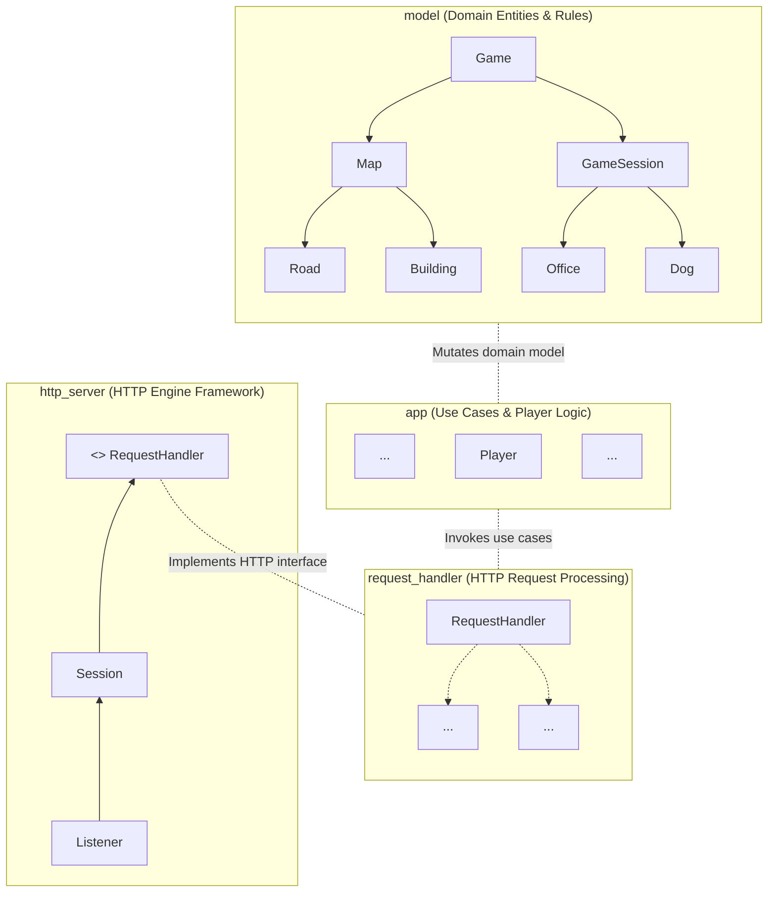
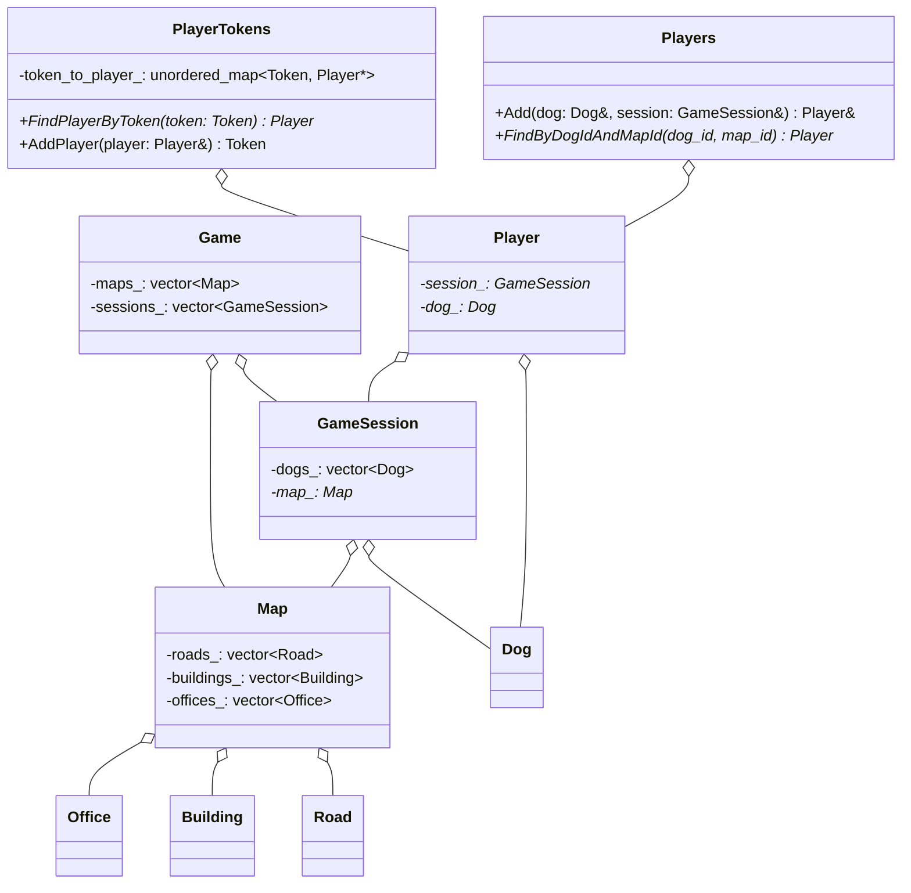

# Multiplayer Game Server (C++)

An asynchronous, multithreaded game server written in C++ using **Boost.Asio** and **PostgreSQL**[cite: 1]. Players connect to game maps, control dogs to gather lost items, deliver them to lost-and-found offices to score points, and compete on a persistent high-score leaderboard[cite: 1].

---

## Table of Contents

- [Overview](#overview)
- [Key Features](#key-features)
- [System Architecture](#system-architecture)
  - [Module Hierarchy](#module-hierarchy)
  - [Domain Class Model](#domain-class-model)
- [Concurrency & Thread Safety](#concurrency--thread-safety)
- [Authentication & Session Flow](#authentication--session-flow)
- [Tech Stack](#tech-stack)

---

## Overview

The game server acts as the **single source of truth** for the game state[cite: 1]. Clients receive a customized subset of the world model based on their active map and player context[cite: 1]:
* **Detailed Info:** Players get full state metrics for their own character (current score, carried items, velocity, position)[cite: 1].
* **Minimal Info:** Information about opponent players is limited to essential state (nickname, position, velocity)[cite: 1].

### Gameplay Mechanics
* **Objective:** Navigate game maps, pick up lost items on roads, and deliver them to lost-and-found offices to score points[cite: 1].
* **Session Lifecycle:** Inactivity triggers game-over conditions[cite: 1]. Scores are submitted to the global scoreboard upon completion[cite: 1].
* **Persistence:** The server periodically saves its world state to disk to ensure recovery after restarts or crashes[cite: 1]. High score leaderboards are stored in a PostgreSQL database[cite: 1].

---

## Key Features

- **Asynchronous HTTP Engine:** High-performance REST API powered by `Boost.Asio` and `Boost.Beast`[cite: 1].
- **Strand-Based Thread Safety:** Multi-threaded request dispatching protected from race conditions via `boost::asio::strand`[cite: 1].
- **State Persistence & Recovery:** Automatic periodic state snapshotting to disk and database integration for high scores[cite: 1].
- **Modular Layered Architecture:** Decoupled modules following the Dependency Inversion Principle (DIP)[cite: 1].

---

## System Architecture

### Module Hierarchy

The codebase is split into decoupled layers[cite: 1]. High-level application modules depend on abstractions rather than low-level details[cite: 1].



* **`model`**: Physical world entities, movement mechanics, collision rules, and game logic.


* **`app`**: Player abstractions, authentication management, and application use-cases.


* **`request_handler`**: Maps incoming REST/JSON API requests to application scenarios.


* **`http_server`**: Reusable, protocol-agnostic asynchronous HTTP transport layer.


---

### Domain Class Model



---

## Concurrency & Thread Safety

To prevent data races while executing across multiple worker threads, domain state modifications are dispatched through `boost::asio::strand`.

### Strand Request Dispatching

```c++
class RequestHandler : public std::enable_shared_from_this<RequestHandler> {
public:
    using Strand = net::strand<net::io_context::executor_type>;

    RequestHandler(fs::path root, Strand api_strand)
        : root_{std::move(root)}
        , api_strand_{api_strand} {}

    template <typename Body, typename Allocator, typename Send>
    void operator()(tcp::endpoint, http::request<Body, http::basic_fields<Allocator>>&& req, Send&& send) {
        auto version = req.version();
        auto keep_alive = req.keep_alive();

        try {
            if (IsApiRequest(req)) {
                auto handle = [self = shared_from_this(), send, req = std::forward<decltype(req)>(req), version, keep_alive] {
                    try {
                        assert(self->api_strand_.running_in_this_thread());
                        return send(self->HandleApiRequest(req));
                    } catch (...) {
                        send(self->ReportServerError(version, keep_alive));
                    }
                };
                return net::dispatch(api_strand_, handle);
            }
            
            return std::visit([&send](auto&& result) {
                send(std::forward<decltype(result)>(result));
            }, HandleFileRequest(req));
        } catch (...) {
            send(ReportServerError(version, keep_alive));
        }
    }

private:
    fs::path root_;
    Strand api_strand_;
};

```

---

## Authentication & Session Flow

1. **Join Request:** When a client connects, they specify a target map and a dog nickname.


2. **Token Generation:** The server creates a `Dog` entity with a unique numerical ID, assigns it to a `GameSession`, and generates a secure bearer token (UUID) via `PlayerTokens`.


3. **Authorization Header:** All subsequent requests require the token passed in the `Authorization` standard HTTP header:


```http
Authorization: Bearer <auth_token>

```

4. **Validation:** The server looks up the player state using `PlayerTokens::FindPlayerByToken(token)` before performing actions on the character.
