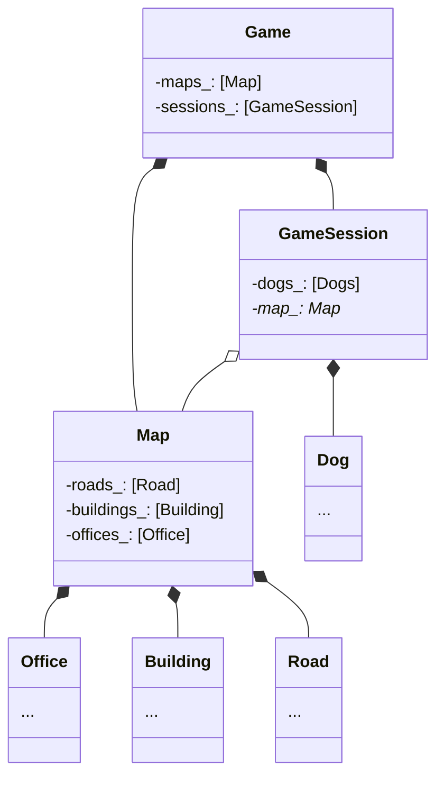
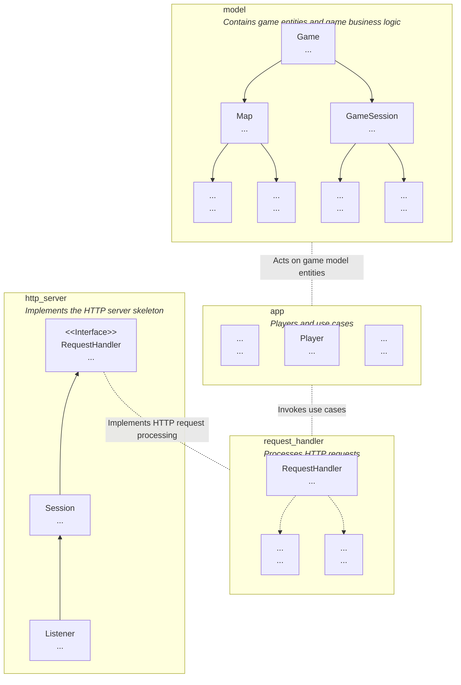
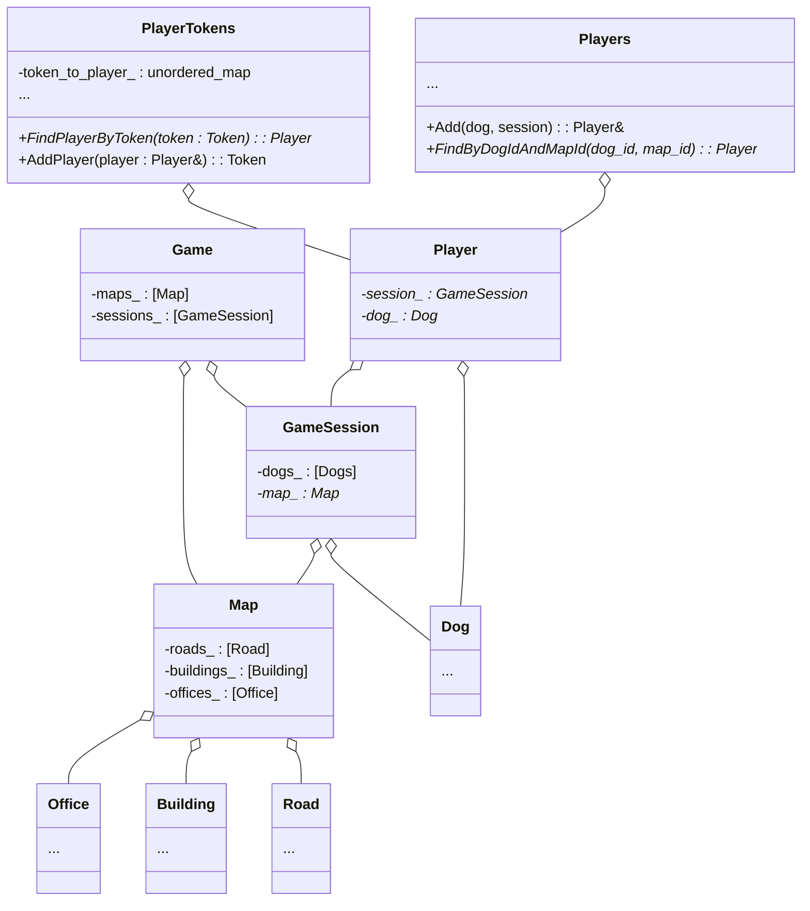
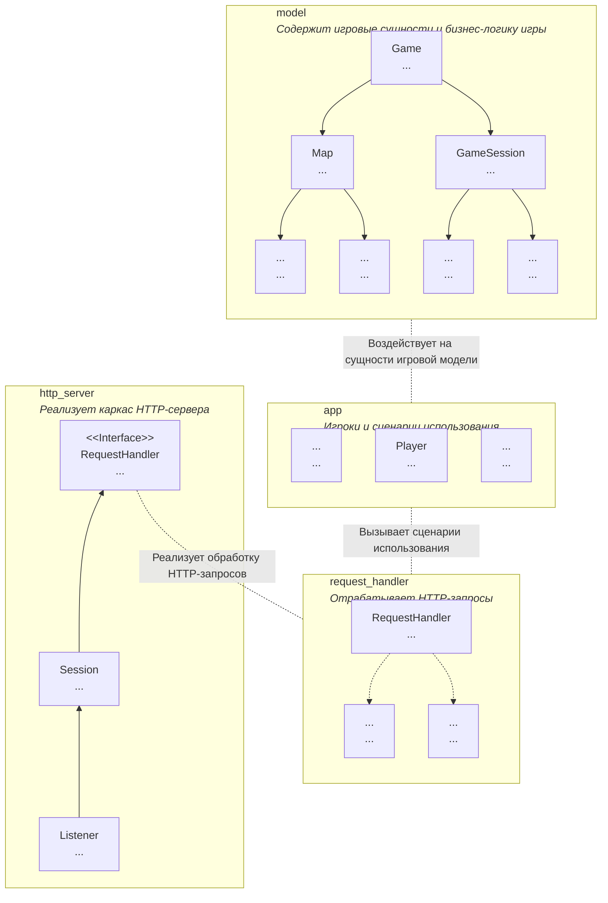

# ENGLISH

---

# Game Server Architecture

* The user will select a map and join the game. In the game, they will control a dog that collects lost items on the road and returns them to the lost-and-found office.
* Multiple players can be on the same map simultaneously. Each player will only be able to control their own dog, but will see the actions of competitors.
* Points are awarded to the player for delivered items. The goal of the game is to score more points than opponents.
* The game ends if the dog remains motionless for a long time. At that moment, a scoreboard showing the top players' results is displayed.
* The server is capable of restoring its state after a restart or crash. To achieve this, it will periodically save its state to a disk file and load it into memory upon startup.
* The high scores table will be stored in a PostgreSQL database.

## Game Server Model

Clients receive a representation of the world model from the server — a set of data describing the world model from the perspective of each specific client.

A player can be on one of the selected game maps and control only their character. Therefore, it is sufficient to send the user information about game objects that are on the same map as them.

The server can send detailed information to a player only about their own character: score points, items carried by that player's character. Regarding other players' characters, the client will only receive the necessary minimum: name, coordinates, and velocity.

> The game server is the single source of truth for the game state, while each client is aware only of the part of information that directly concerns them.

The game consists of several game maps containing buildings, roads, and lost-and-found offices.

## Joining the Game

When a client joins the game, a character appears on the map chosen by the client. This is the dog controlled by the player.

Game session (`GameSession`) — Game characters will become part of a game session, which, in turn, will store a reference to the map.

`GameSession` is responsible for storing the list of dogs, while the `Dog` class stores information about a specific dog. To distinguish dogs from one another, the player must specify their dog's nickname when joining the game.
If multiple players specify the same nickname for their dogs, several dogs with the same name will exist on the map. To solve this problem, each dog has a unique identifier.
It can be used as an alternative to an object reference and as a key for a `map` or `unordered_map` of `std::uint32_t` or `std::uint64_t` format.



### The Algorithm for Adding a Dog to a Game Session Works as Follows:

* Find the game session corresponding to the map the client wants to play on.
* Inside the game session, add a new dog with the specified name and generated `id`.

After these actions, a new dog with a unique numeric identifier will be created inside the game session.

## Model Protection in a Multithreaded Application

To protect the model from race conditions, `boost::asio::strand` is used via the `boost::asio::dispatch` function.
To ensure that code executes inside a strand, use the `strand::running_in_this_thread` method. It returns `true` if the current thread is executing a function posted, dispatched, or deferred to the `strand`.

Example `RequestHandler`:

```c++
class RequestHandler : public std::enable_shared_from_this<RequestHandler> {
public:
    using Strand = net::strand<net::io_context::executor_type>;

    RequestHandler(fs::path root, Strand api_strand, /* other parameters */)
        : root_{std::move(root)}
        , api_strand_{api_strand}
        , /* initialize remaining fields */ {
    }

    RequestHandler(const RequestHandler&) = delete;
    RequestHandler& operator=(const RequestHandler&) = delete;

    template <typename Body, typename Allocator, typename Send>
    void operator()(tcp::endpoint, http::request<Body, http::basic_fields<Allocator>>&& req, Send&& send) {
        auto version = req.version();
        auto keep_alive = req.keep_alive();

        try {
            if (/* req belongs to API? */) {
                auto handle = [self = shared_from_this(), send,
                               req = std::forward<decltype(req)>(req), version, keep_alive] {
                    try {
                        // This assert won't trigger as the lambda executes inside the strand
                        assert(self->api_strand_.running_in_this_thread());
                        return send(self->HandleApiRequest(req));
                    } catch (...) {
                        send(self->ReportServerError(version, keep_alive));
                    }
                };
                return net::dispatch(api_strand_, handle);
            }
            // Return result of handling file request
            return std::visit(
                [&send](auto&& result) {
                    send(std::forward<decltype(result)>(result));
                },
                HandleFileRequest(req));
        } catch (...) {
            send(ReportServerError(version, keep_alive));
        }
    }

private:
    using FileRequestResult = std::variant<EmptyResponse, StringResponse, FileResponse>;

    FileRequestResult HandleFileRequest(const StringRequest& req) const;
    StringResponse HandleApiRequest(const StringRequest& request) const;
    StringResponse ReportServerError(unsigned version, bool keep_alive) const;

    fs::path root_;
    Strand api_strand_;
    /* other data */
};

```

Example usage of `RequestHandler`:

```c++
const unsigned num_threads = std::thread::hardware_concurrency();

net::io_context ioc{num_threads};

fs::path static_files_root = ...;

// Strand for executing API requests
auto api_strand = net::make_strand(ioc);

// Create request handler on the heap managed by shared_ptr
auto handler = std::make_shared<http_handler::RequestHandler>(
    static_files_root, api_strand, /* other parameters required by RequestHandler */);

// Wrap it in a logging decorator
server_logging::LoggingRequestHandler logging_handler{
    [handler](auto&& endpoint, auto&& req, auto&& send) {
        // Handle the request
        (*handler)(std::forward<decltype(endpoint)>(endpoint),
            std::forward<decltype(req)>(req),
            std::forward<decltype(send)>(send));
            }};

// Start request processing
http_server::ServeHttp(ioc, {address, port}, logging_handler);

RunWorkers(std::max(1u, num_threads), [&ioc] {
    ioc.run();
});

```

## Game Server Modules



* **Model** contains information about all game objects and the business rules governing all objects in the game. Which direction a dog faces, whether it is running or standing, and how it can or cannot move are defined in this module. It represents the physical world.
* **Application Level** introduces the concept of players and use cases, such as joining the game, retrieving game state, and acting on dogs. In this module, dogs acquire agency. If in the future you want dogs to be controlled by AI, you can place the corresponding code here.
* **Request Processing Code** — the server's connection to the outside world. Upon receiving a "run" request, the targeted player's dog will run. Upon receiving a "get player list" request, the server will inform the outside world about which players are present on the map.
* **HTTP Server** provides the framework for an abstract HTTP server. It can asynchronously accept requests, delegating their processing to the request processing code. If you decide to build a search engine or an online translator instead of a game server, you will only need to change the request handler without modifying the HTTP server skeleton code.

Dependencies between modules must also be structured:

* There should be no circular dependencies between modules. If at least one class in module A depends directly or indirectly on classes in module B, module B must not contain classes that directly or indirectly depend on classes in module A. If such dependencies exist, it means some classes belong in a different module. In the diagram, inter-module dependencies (shown with dashed arrows) do not form cycles.
* Dependencies between modules must follow the Dependency Inversion Principle. For example, the abstract `http_server` module declares the `RequestHandler` interface, which is implemented inside the concrete `request_handler` module.

# Joining the Game and Game State

---

In order for the server to authenticate clients, it must generate a secret token (UUID) for each client that joins the game and pass it to the client alongside their dog's ID. The generated token and its associated client information are stored on the server. Joining the game is the only place where the token is transferred from the server to the client.

Example UUID generator:

```c++
#include <iostream>
#include <boost/uuid/uuid.hpp>
#include <boost/uuid/uuid_generators.hpp>
#include <boost/uuid/uuid_io.hpp>

namespace detail {
struct TokenTag {};
}  // namespace detail

using Token = util::Tagged<std::string, detail::TokenTag>;

class PlayerTokens {
    ...
private:
    boost::uuids::random_generator gen;
    const boost::uuids::uuid id = gen();
    // To generate a token, retrieve two 64-bit numbers from generator1_ and generator2_,
    // convert them to hex strings, and concatenate them together.
    // You can experiment with the token generation algorithm
    // to make guessing them even more difficult.
};

```



## Passing the Token from Client to Server
The original document ends right at the header **"Passing the Token from Client to Server"** without any subsequent content [source: 1].

If you have additional sections of the file, Russian text, or specific HTTP endpoint specs you would like added here, please share them! Otherwise, here is a logical template completing that final section based on the context of the document:

---

## Passing the Token from Client to Server

To perform authorized requests (e.g., getting the current game state, moving a character, or leaving the session), the client must send its assigned secret token with every HTTP request.

* **Transport Mechanism:** The token is sent in the `Authorization` HTTP header using the `Bearer` scheme:

```http
Authorization: Bearer <your_token_here>

```


* **Validation:**
1. The server extracts the token string from the `Authorization` header.
2. It uses `PlayerTokens::FindPlayerByToken(token)` to look up the associated `Player` instance.
3. If the token is valid and active, the server executes the requested action on behalf of that player's dog.
4. If the token is missing, malformed, or not found in `PlayerTokens`, the server returns an HTTP error response (`401 Unauthorized` or `403 Forbidden`) formatted as JSON.

---

# RUSSIAN

---

# Архитектура игрового сервера

- Пользователь выберет карту и войдёт в игру. В игре он будет управлять псом, который собирает на дороге потерянные вещи и относит их в бюро находок. 
- На одной карте одновременно могут находиться несколько игроков. Каждый из них сможет управлять только своим псом, но увидит действия конкурентов. 
- За доставленные предметы игроку начисляются баллы. Цель игры — набрать больше баллов, чем у соперников. 
- Игра заканчивается, если пёс долго находится без движения. В этот момент отображается таблица с результатами лучших игроков. 
- Сервер способен восстанавливать своё состояние после перезапуска или при аварийном завершении работы. Для этого он будет периодически сохранять своё состояние в файл на диске и при старте загружать его в память. 
- Таблица рекордов будет храниться в базе данных PostgreSQL

## модель игрового сервера

Клиенты получают от сервера представление модели мира — набор данных, описывающих модель мира с точки зрения каждого конкретного клиента.

Игрок может находиться на одной из выбранных игровых карт и управлять только своим персонажем. Поэтому достаточно отправить пользователю информацию об игровых объектах, которые с ним на одной карте.

Сервер может отправить игроку подробную информацию лишь о его персонаже: количество набранных очков, предметы, которые несёт персонаж этого игрока. О персонажах других игроков клиент получит только необходимый минимум: имя, координаты и скорость.

> Игровой сервер — источник правды о состоянии игры, а каждый клиент в курсе лишь той части информации, которая касается лично его.

Игра состоит из нескольких игровых карт, на которых располагаются здания, дороги и офисы бюро находок

## Вход в игру

Когда клиент входит в игру, на выбранной клиентом карте появляется персонаж. Это пёс, которым управляет игрок

сеанс игры `GameSession` - Игровые персонажи станут частью сеанса игры, который, в свою очередь, будет хранить ссылку на карту. 

`GameSession` отвечает за хранение списка собак, а класс Dog хранит информацию о конкретной собаке. Чтобы собак можно было друг от друга отличать, игрок при входе в игру должен указать кличку своей собаки.
Если несколько игроков укажут для своих собак одну и ту же кличку, на карте будут находиться несколько псов с одним именем. Для решение данной проблемы каждая собака имеет уникальный идентификатор.
Его можно использовать как альтернативу ссылке на объект и в качестве ключа `map` или `unordered_map` формата `std::uint32_t` или `std::uint64_t`


### Алгоритм добавления собаки в игровой сеанс будет выглядеть так.

- Найти игровой сеанс, соответствующий карте, на которой хочет играть клиент. 
- Внутри игрового сеанса добавить нового пса с указанным именем и сгенерированным `id`.

После этих действий внутри игрового сеанса будет создан новый пёс с уникальным числовым идентификатором

## Защита модели в многопоточном приложении

для защиты модели от состояния гонки используется `boost::asio::strand` используя функцию `boost::asio::dispatch`.
Чтобы убедиться, что код выполняется внутри strand, используйте метод `strand::running_in_this_thread`. Он возвращает `true`, если текущий поток выполняет функцию, отправленную в `strand` через `post`, `dispatch` или `defer`

Пример `RequestHandler`

```c++
class RequestHandler : public std::enable_shared_from_this<RequestHandler> {
public:
    using Strand = net::strand<net::io_context::executor_type>;

    RequestHandler(fs::path root, Strand api_strand, /* прочие параметры */)
        : root_{std::move(root)}
        , api_strand_{api_strand}
        , /*инициализируем остальные поля*/ {
    }

    RequestHandler(const RequestHandler&) = delete;
    RequestHandler& operator=(const RequestHandler&) = delete;

    template <typename Body, typename Allocator, typename Send>
    void operator()(tcp::endpoint, http::request<Body, http::basic_fields<Allocator>>&& req, Send&& send) {
        auto version = req.version();
        auto keep_alive = req.keep_alive();

        try {
            if (/*req относится к API?*/) {
                auto handle = [self = shared_from_this(), send,
                               req = std::forward<decltype(req)>(req), version, keep_alive] {
                    try {
                        // Этот assert не выстрелит, так как лямбда-функция будет выполняться внутри strand
                        assert(self->api_strand_.running_in_this_thread());
                        return send(self->HandleApiRequest(req));
                    } catch (...) {
                        send(self->ReportServerError(version, keep_alive));
                    }
                };
                return net::dispatch(api_strand_, handle);
            }
            // Возвращаем результат обработки запроса к файлу
            return std::visit(
                [&send](auto&& result) {
                    send(std::forward<decltype(result)>(result));
                },
                HandleFileRequest(req));
        } catch (...) {
            send(ReportServerError(version, keep_alive));
        }
    }

private:
    using FileRequestResult = std::variant<EmptyResponse, StringResponse, FileResponse>;

    FileRequestResult HandleFileRequest(const StringRequest& req) const;
    StringResponse HandleApiRequest(const StringRequest& request) const;
    StringResponse ReportServerError(unsigned version, bool keep_alive) const;

    fs::path root_;
    Strand api_strand_;
    /* прочие данные */
};
```

Пример использования `RequestHandler`

```c++
const unsigned num_threads = std::thread::hardware_concurrency();

net::io_context ioc{num_threads};

fs::path static_files_root = ...;

// strand для выполнения запросов к API
auto api_strand = net::make_strand(ioc);

// Создаём обработчик запросов в куче, управляемый shared_ptr
auto handler = std::make_shared<http_handler::RequestHandler>(
    static_files_root, api_strand, /*прочие параметры, нужные RequestHandler*/);

// Оборачиваем его в логирующий декоратор
server_logging::LoggingRequestHandler logging_handler{
    [handler](auto&& endpoint, auto&& req, auto&& send) {
        // Обрабатываем запрос
        (*handler)(std::forward<decltype(endpoint)>(endpoint),
            std::forward<decltype(req)>(req),
            std::forward<decltype(send)>(send));
            }};

// Запускаем обработку запросов
http_server::ServeHttp(ioc, {address, port}, logging_handler);

RunWorkers(std::max(1u, num_threads), [&ioc] {
    ioc.run();
});
```

## Модули игрового сервера



- **Модель** содержит информацию обо всех игровых объектах и бизнес-правила, которым подчиняются все объекты игры. То, в каком направлении смотрит пёс, бежит он или стоит, как он может и не может перемещаться, определяется в этом модуле. Он воплощает мир физический.
- **Прикладной уровень** вводит понятие игроков и сценарии использования, такие как вход в игру, получение состояния игры, воздействие на псов. В этом модуле у псов как бы появляется субъектность. Если в будущем вы захотите, чтобы псами управлял ИИ, можете разместить соответствующий код здесь.
- **Код обработки запросов** — связь сервера с внешним миром. Получив запрос «бежать», пёс игрока, которому он адресован, побежит. Получив запрос «вернуть список игроков», сервер сообщит внешнему миру о том, какие игроки присутствуют на карте.
- **HTTP-сервер** предоставляет каркас абстрактного HTTP-сервера. Он умеет асинхронно принимать запросы, делегируя их обработку коду обработки запросов. Если вы решите создать вместо игрового сервера поисковую систему или онлайн-переводчик, вам нужно будет изменить обработчик запросов, не меняя код каркаса HTTP-сервера.

Порядку должны быть подчинены и зависимости между модулями. 
- Между модулями не должно быть циклических зависимостей. Если хотя бы один класс модуля A зависит прямо или косвенно от классов модуля B, в модуле B не должно быть классов, которые прямо или косвенно зависели бы от классов модуля A. Если такие зависимости есть, значит, какие-то классы попали не в свой модуль. На схеме зависимости между модулями (показаны пунктирными стрелками) не формируют циклов. 
- Зависимости между модулями должны подчиняться принципу инверсии зависимостей. Например, абстрактный модуль `http_server` объявляет интерфейс `RequestHandler`, реализуемый внутри конкретного модуля `request_handler`.

# Вход в игру и игровое состояние

--- 

Чтобы сервер мог аутентифицировать клиентов, он должен сгенерировать для каждого клиента, вошедшего в игру, секретный токен (UUID) и передать его клиенту вместе с id его собаки. Сгенерированный токен и связанная с ним информация о клиенте хранятся на сервере. Вход в игру — единственное место, в котором от сервера клиенту передаётся токен.

пример UUID генератора

```c++
#include <iostream>
#include <boost/uuid/uuid.hpp>
#include <boost/uuid/uuid_generators.hpp>
#include <boost/uuid/uuid_io.hpp>

namespace detail {
struct TokenTag {};
}  // namespace detail

using Token = util::Tagged<std::string, detail::TokenTag>;

class PlayerTokens {
    ...
private:
    boost::uuids::random_generator gen;
    const boost::uuids::uuid id = gen();
    // Чтобы сгенерировать токен, получите из generator1_ и generator2_
    // два 64-разрядных числа и, переведя их в hex-строки, склейте в одну.
    // Вы можете поэкспериментировать с алгоритмом генерирования токенов,
    // чтобы сделать их подбор ещё более затруднительным
};
```


    