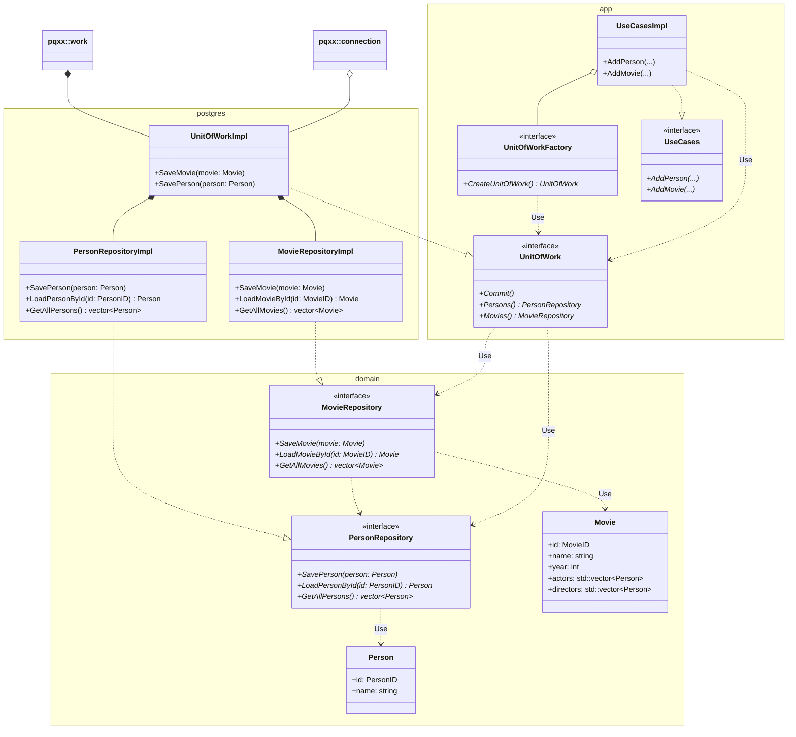

# Решение: транзакции

Примеры выше приводятся не просто так. Для них всех есть одно решение — транзакции. 

**Транзакция** — это произвольный набор действий с БД (чтений и модификаций), которые происходят атомарно по отношению к другим пользователям. 

Это значит, что транзакция может либо выполниться, либо не выполниться целиком, но не может выполниться частично. Если хотя бы одно действие транзакции завершилось неуспехом, то все остальные также не имеют эффекта. 

Другая особенность транзакции — сторонний наблюдатель не может увидеть части изменений, которые совершены в рамках транзакций, и не увидеть другой части. Для других пользователей БД остаётся в неизменном виде, пока у объекта транзакции, имеющего тип `pqxx::work`, не будет вызван метод `commit`.

---

## Практический пример работы транзакций

Проверим, как работают транзакции на практике. Для этого откроем два окна терминала и в обоих запустим `psql`, подключаясь к одной и той же БД. В одном из них создадим таблицу и добавим в неё нужные значения:

```sql
CREATE TABLE accounts (
    id SERIAL PRIMARY KEY, 
    funds integer CHECK (funds >= 0), 
    name text
);
-- CREATE TABLE

INSERT INTO accounts (funds, name) VALUES 
    (50, 'Ostap'), 
    (0, 'Shura'), 
    (0, 'Panikovsky');
-- INSERT 0 3

SELECT * FROM accounts;
```

```text
 id | funds |    name    
----+-------+------------
  1 |    50 | Ostap
  2 |     0 | Shura
  3 |     0 | Panikovsky
(3 rows)
```

### Воспроизведение проблемы без транзакций

Попробуем воспроизвести вторую мошенническую схему Бендера. Она начинается с перевода 100 рублей Шуре:

**Окно 1:**
```sql
1> UPDATE accounts SET funds = funds + 100 WHERE name='Shura';
-- UPDATE 1

1> UPDATE accounts SET funds = funds - 100 WHERE name='Ostap';
-- ERROR:  new row for relation "accounts" violates check constraint "accounts_funds_check"
-- DETAIL:  Failing row contains (1, -50, Ostap).

1> SELECT * FROM accounts;
```
```text
 id | funds |    name    
----+-------+------------
  3 |     0 | Panikovsky
  1 |    50 | Ostap
  2 |   100 | Shura
(3 rows)
```

Попытка забрать 100 рублей со счёта Бендера не удалась. По идее ничего страшного — сейчас мы отменим перевод и заберём сотню у Шуры. Но не тут-то было. В этот момент в другом окне совершается перевод на счёт Паниковского:

**Окно 2:**
```sql
2> UPDATE accounts SET funds = funds + 100 WHERE name='Panikovsky';
-- UPDATE 1

2> UPDATE accounts SET funds = funds - 100 WHERE name='Shura';
-- UPDATE 1
```

Это перевод полностью успешен. И только после него в первом окне происходит попытка вернуть честно заработанные банком деньги:

**Окно 1:**
```sql
1> UPDATE accounts SET funds = funds - 100 WHERE name='Shura';
-- ERROR:  new row for relation "accounts" violates check constraint "accounts_funds_check"
-- DETAIL:  Failing row contains (2, -100, Shura).

1> SELECT * FROM accounts;
```
```text
 id | funds |    name    
----+-------+------------
  1 |    50 | Ostap
  3 |   100 | Panikovsky
  2 |     0 | Shura
(3 rows)
```

Однако деньги уже уплыли со счёта, и забирать теперь нечего.

---

### Использование транзакций

Теперь посмотрим, как бы это выглядело в случае использования транзакций. Вернём счета в первоначальное состояние и в обоих окнах начнём транзакцию командой `START TRANSACTION`:

```sql
1> UPDATE accounts SET funds = 0 WHERE name='Panikovsky';
-- UPDATE 1

1> START TRANSACTION;
-- START TRANSACTION

2> START TRANSACTION;
-- START TRANSACTION
```

В первом окне начинаем перевод:

**Окно 1:**
```sql
1> UPDATE accounts SET funds = funds + 100 WHERE name='Shura';
-- UPDATE 1

1> UPDATE accounts SET funds = funds - 100 WHERE name='Ostap';
-- ERROR:  new row for relation "accounts" violates check constraint "accounts_funds_check"
-- DETAIL:  Failing row contains (1, -50, Ostap).
```

Теперь во втором окне пробуем перевести сотню Паниковскому:

**Окно 2:**
```sql
2> UPDATE accounts SET funds = funds + 100 WHERE name='Panikovsky';
-- UPDATE 1

2> UPDATE accounts SET funds = funds - 100 WHERE name='Shura';
-- ERROR:  new row for relation "accounts" violates check constraint "accounts_funds_check"
-- DETAIL:  Failing row contains (2, -100, Shura).
```

Неожиданно нас постигает неудача. При выполнении неуспешной операции транзакция считается испорченной. Остаётся только отменить её, чтобы продолжить работать с базой. Это делается командой `ROLLBACK`:

```sql
1> ROLLBACK;
2> ROLLBACK;

1> SELECT * FROM accounts;
```
```text
 id | funds |    name    
----+-------+------------
  1 |    50 | Ostap
  3 |     0 | Panikovsky
  2 |     0 | Shura
```

Состояние таблицы вернулось к первоначальному, как будто ничего и не было. 

---

### Изоляция и параллельные транзакции

Разберёмся, почему так произошло. Для этого повторим начало схемы и запросим состояние таблицы в одном и другом окне. Обратите внимание, в каком окне выполняется каждая команда:

```sql
1> START TRANSACTION;
-- START TRANSACTION

1> UPDATE accounts SET funds = funds + 100 WHERE name='Shura';
-- UPDATE 1

2> START TRANSACTION;
-- START TRANSACTION

2> UPDATE accounts SET funds = funds + 100 WHERE name='Panikovsky';
-- UPDATE 1

1> SELECT * FROM accounts ORDER BY id;
```
```text
 id | funds |    name    
----+-------+------------
  1 |    50 | Ostap
  2 |   100 | Shura
  3 |     0 | Panikovsky
(3 rows)
```

```sql
2> SELECT * FROM accounts ORDER BY id;
```
```text
 id | funds |    name    
----+-------+------------
  1 |    50 | Ostap
  2 |     0 | Shura
  3 |   100 | Panikovsky
(3 rows)
```

Заметьте, что теперь `SELECT` в двух окнах выдаёт разное. Действительно, транзакции имеют разное представление о таблице. Такова особенность SQL — в один и тот же момент может существовать несколько «истин».

Откроем третье окно и попробуем запросить состояние в нём:

**Окно 3:**
```sql
3> SELECT * FROM accounts;
```
```text
 id | funds |    name    
----+-------+------------
  1 |    50 | Ostap
  2 |     0 | Shura
  3 |     0 | Panikovsky
(3 rows)
```

Это третий вариант и третья «истина», которую видят все остальные наблюдатели. В случае успешного перевода невозможно увидеть состояние, при котором деньги поступили на счёт получателя, но ещё не списались со счёта отправителя. И наоборот: нельзя увидеть, чтобы деньги уже списались, но ещё не пришли. Сторонний наблюдатель может увидеть либо совершённый перевод, либо состояние до перевода.

Отменим транзакции и убедимся, что таблица вернулась в исходное состояние:

```sql
1> ROLLBACK;
2> ROLLBACK;

1> SELECT * FROM accounts;
```
```text
 id | funds |    name    
----+-------+------------
  1 |    50 | Ostap
  3 |     0 | Panikovsky
  2 |     0 | Shura
```
```sql
2> SELECT * FROM accounts;
```
```text
 id | funds |    name    
----+-------+------------
  1 |    50 | Ostap
  3 |     0 | Panikovsky
  2 |     0 | Shura
```

---

### Успешная фиксация (COMMIT)

Теперь представим, что в Бендере проснулась совесть, и он решил жить по средствам:

**Окно 1:**
```sql
1> START TRANSACTION;
-- START TRANSACTION

1> UPDATE accounts SET funds = funds + 50 WHERE name='Shura';
-- UPDATE 1

1> UPDATE accounts SET funds = funds - 50 WHERE name='Ostap';
-- UPDATE 1
```

Несмотря на то, что всё прошло хорошо, на данном этапе сторонние наблюдатели не увидят никаких изменений:

**Окно 3:**
```sql
3> SELECT * FROM accounts;
```
```text
 id | funds |    name    
----+-------+------------
  1 |    50 | Ostap
  2 |     0 | Shura
  3 |     0 | Panikovsky
(3 rows)
```

Нужно применить транзакцию командой `COMMIT`, после чего изменения станут общедоступны:

```sql
1> COMMIT;
-- COMMIT

3> SELECT * FROM accounts;
```
```text
 id | funds |    name    
----+-------+------------
  1 |     0 | Ostap
  2 |    50 | Shura
  3 |     0 | Panikovsky
(3 rows)
```

---

# Unit of Work

При использовании паттерна «Репозиторий» каждое действие выполняется в отдельной транзакции. У такого подхода есть два минуса:
1. Не получится комбинировать действия в одну транзакцию.
2. Это неэффективно.

Операции создания и выполнения транзакций могут потреблять вычислительные ресурсы, и если есть возможность сделать несколько действий в рамках одной транзакции, то лучше сделать это.

Чтобы решить проблему, применяется паттерн **Unit of Work** (единица работы). Идея состоит в том, что теперь приложение не имеет прямого доступа к репозиторию. Репозиторий можно получить только имея объект типа `UnitOfWork`. Сам объект типа `UnitOfWork` можно сконструировать, имея фабрику объектов этого типа. Именно фабрика изначально доступна приложению.

В рамках одной транзакции может понадобиться изменить сразу несколько таблиц. Например, мы добавили книгу и её авторов. Если у этих авторов нет других книг, то и книга, и авторы не имеют смысла друг без друга. Их нужно добавить обязательно в рамках одной транзакции. Поэтому Unit of Work должен обслуживать сразу все таблицы.



В терминах PostgreSQL объект типа `UnitOfWork` представляет одну транзакцию. Репозитории, полученные через этот объект, будут оперировать этой конкретной транзакцией.

Ещё одна возможность, которую даёт Unit of Work — он позволяет комбинировать несколько запросов в один. В первую очередь это касается запросов `INSERT INTO`. Если в рамках одной транзакции подряд добавлено несколько объектов, то Unit of Work имеет право отправить их в БД одним запросом, что намного эффективнее, чем если добавлять по одному.
